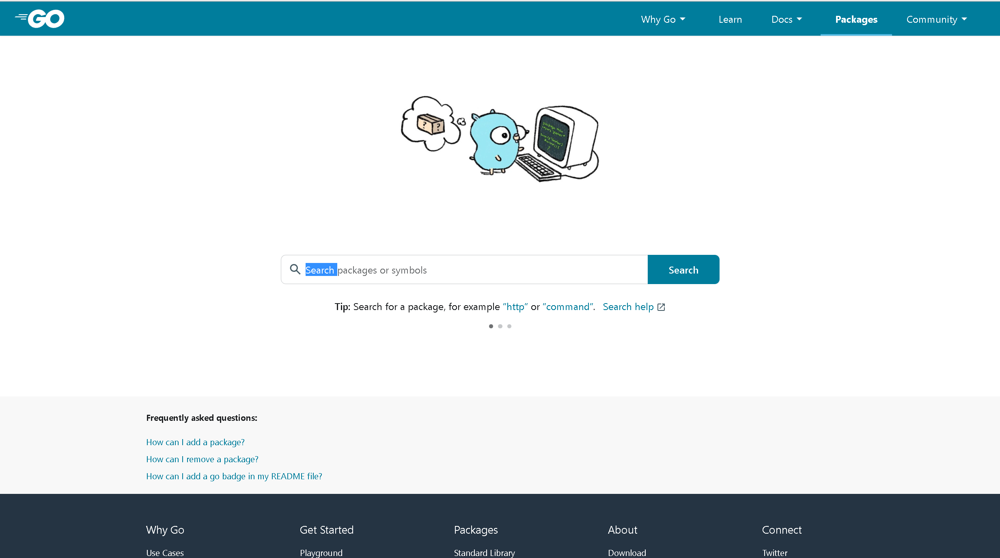
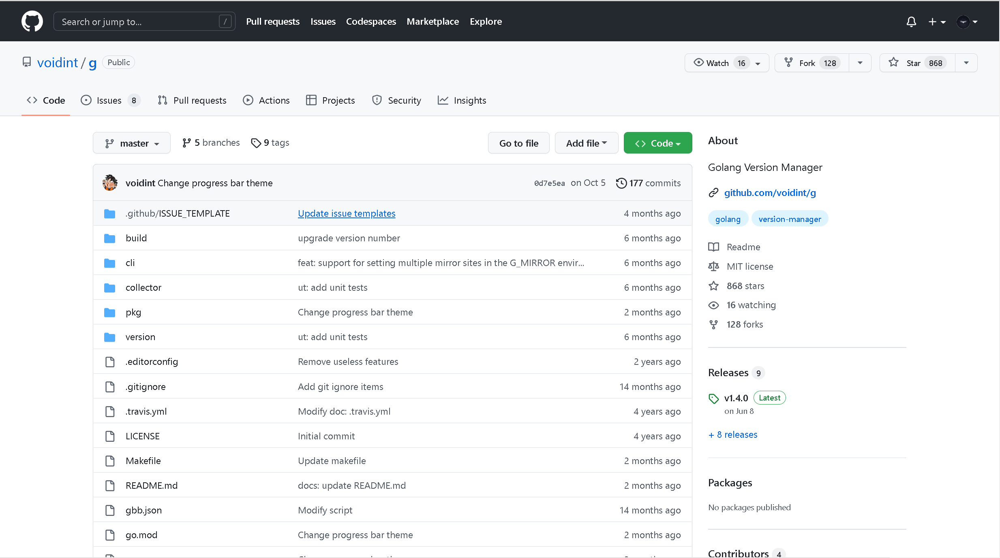
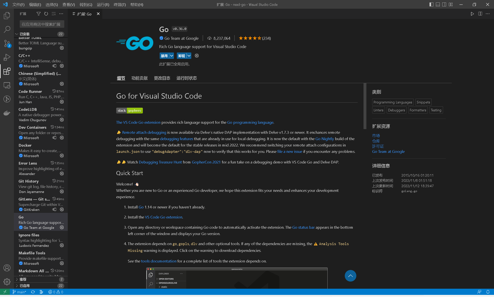
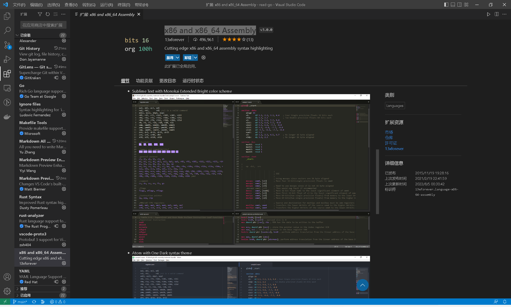
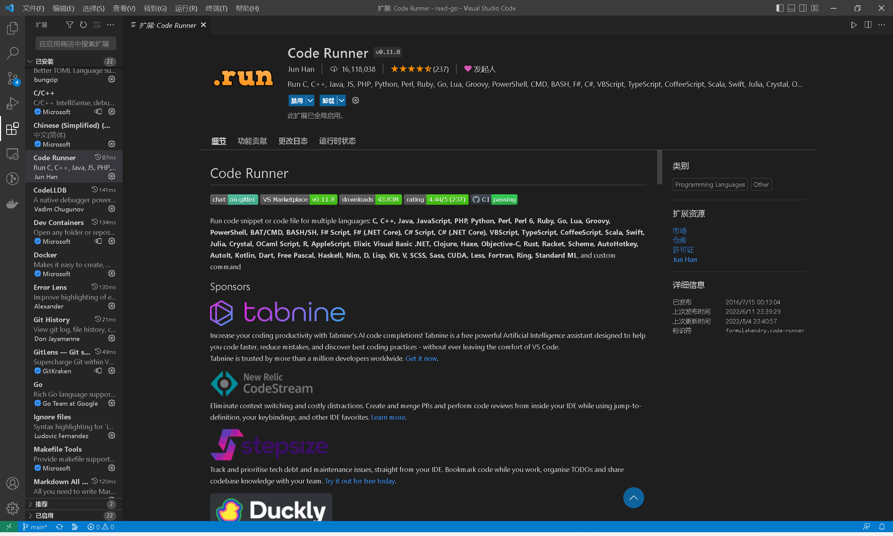

# GO语言基础

## go语言的诞生
2007 年 9 月 20 日的下午，在谷歌山景城总部的一间办公室里，谷歌的大佬级程序员 Rob Pike在等待一个 C++ 项目构建的过程中和谷歌的另外两个大佬级程序员 Robert Griesemer和 Ken Thompson进行了一次有关设计一门新编程语言的讨论。


Go语言之父(从左到右分别是Robert Griesemer、Rob Pike和Ken Thompson)

当时的谷歌内部主要使用 C++ 语言构建各种系统，但 C++ 的巨大复杂性、编译构建速度慢以及在编写服务端程序时对并发支持的不便等让三位大佬产生了重新设计一门新编程语言的想法。在他们的初步构想中，这门新语言应该是能够给程序员带来快乐、匹配未来硬件发展趋势并适合用来开发谷歌内部大规模程序的。

2009 年 11 月 10 日，Go 语言正式对外发布并开源。

Go语言具有支持高并发的特性，可以很方便地实现多线程运算，充分利用多核心 cpu 的性能。

## go语言设计哲学

1. 追求简单，少即是多(复杂中的简单)
2. 偏好组合，正交解耦
3. 原生并发，轻量高效
4. 面向工程

## go语言有什么特点？
1. 高性能、并发
2. 语法简单、学习曲线平缓
3. 丰富的标准库
4. 完善的工具链
5. 静态链接
6. 快速编译
7. 跨平台交叉编译
8. 垃圾回收
9. cgo支持
   
## 简单例子
**使用go语言简单实现一个web服务**
``` go
package main

import (
 "net/http"
)

func main() {
 http.Handle("/", http.FileServer(http.Dir(".")))
 http.ListenAndServe("localhost:8080", nil)
}
```

## 使用go的公司
国内:哔哩哔哩(Kratos)、字节跳动(KiteX)、七牛云(goproxy.cn).
国外:google(Kubernetes)、uber(zap)、IBM(fabric,istio)
开源项目:Docker、Kubernetes、Istio、Etcd、prometheus、influxdb、sealos

## 开发环境搭建-安装Golang
|                        https://go.dev                        |
| :----------------------------------------------------------: |
|  |
|                   https://studygolang.com                    |
|  |
|                     https://goproxy.cn/                      |
|  |
|              [Go Packages](https://pkg.go.dev/)              |
|                                   |
|               https://github.com/voidint/g.git               |
|                                            |

## 开发环境搭建-ide

|                      GoLand   开发环境                       |
| :----------------------------------------------------------: |
|  |
|            **Visual Studio Code **  **开发环境**             |
|  |

## vscode扩展推荐

|                 Go                 |
| :--------------------------------: |
|          |
|      x86 and x86_64 Assembly       |
|      |
|            Code Runner             |
|  |

## go通用项目结构

### 最小标准布局

``` shell
// 在Go项目仓库根路径下

- go.mod
- LICENSE
- xx.go
- yy.go

// 或
- go.mod
- LICENSE
- package1
        - package1.go
- package2
        - package2.go
...
```

### 以构建二进制可执行文件为目的的Go项目布局

#### `/cmd`

项目的主干。main包入口

#### `/internal`

私有应用程序和库代码。这是你不希望其他人在其应用程序或库中导入代码。

#### `/pkg`

存放项目自身要使用并且同样也是可执行文件对应main包要依赖的库文件。该目录下的包可以被外部项目引用，算是项目导出包的一个聚合。

### 服务应用程序目录

#### `/api`

OpenAPI/Swagger 规范，JSON 模式文件，协议定义文件。

#### `/web`

静态文件目录

#### `/configs`

配置文件模板或默认配置

#### `/init`

系统初始化配置目录

#### `/build`

持续集成目录

#### `/test`

集成测试目录

#### `/examples`

项目使用示例目录


## Go命名规范

1. 包

   建议以小写形式的单个单词命名，Go语言建议，包名应尽量与包导入路径（import path）的最后一个路径分段保持一致。
   
   我们在给包命名的时候，不仅要考虑包自身的名字，还要兼顾该包导出的标识符（如变量、常量、类型、函数等）的命名。由于对这些包导出标识符的引用必须以包名为前缀，因此对包导出标识符命名时，在名字中不要再包含包名。比如:
   
   ``` go
   strings.Reader              [good]
   strings.StringReader        [bad]
   strings.NewReader           [good]
   strings.NewStringReader     [bad]
   
   bytes.Buffer                [good]
   bytes.ByteBuffer            [bad]
   bytes.NewBuffer             [good]
   bytes.NewByteBuffer         [bad]
   ```

​    2.变量、类型、函数和方法

​		循环和条件变量多采用单个字母命名；

​		函数/方法的参数和返回值变量以单个单词或单个字母为主；

​		由于方法在调用时会绑定类型信息，因此方法的命名以单个单词为主；

​		函数多以多单词的复合词进行命名；

​		类型多以多单词的复合词进行命名。


## go命名建议

1. 变量名成不要携带类型信息

   ``` go
   userSlice []*User         [bad]
   users     []*User         [good]
   ```

   保持变量声明与使用之间的距离越近越好，或者在第一次使用变量之前声明该变量。

2. 保持简短命名变量含以上的一致性

   Go语言中有大量单字母、单个词或缩写命名的简短命名变量。有人可能会认为简短命名变量会降低代码的可读性。Go语言建议通过保持一致性来维持可读性。一致意味着代码中相同或相似的命名所传达的含义是相同或相似的，这样便于代码阅读者或维护者猜测出变量的用途。

   ```go
   // 循环语句中的变量
   for i, v := range s { ... }           // i为下标变量; v为元素值
   for k, v := range m { ... }           // k为key变量; v为元素值
   for v := range r { // channel ... }   // v为元素值
   
   // if、switch/case分支语句中的变量
   if v := mimeTypes[ext]; v != "" { }   // v: 元素值
   switch v := ptr.Elem(); v.Kind() {
       ...
   }
   
   case v := <-c:                        // v: 元素值
   
   // 反射的结果值
   v := reflect.ValueOf(x)
   ```

3. 常量

   Go语言中，常量在命名方式上与变量并无较大差别，并不要求全部大写。只是考虑其含义的准确传递，常量多使用多单词组合的方式命名。

   ``` go
   // $GOROOT/src/net/http/request.go
   
   const (
       defaultMaxMemory = 32 << 20 // 32 MB
   )
   
   const (
       deleteHostHeader = true
       keepHostHeader   = false
   )
   ```

   在Go中数值型常量无须显式赋予类型，常量会在使用时根据左值类型和其他运算操作数的类型进行自动转换，因此常量的名字也不要包含类型信息。

   ``` go
   // $GOROOT/src/math/sin.go
   const (
       PI4A = 7.85398125648498535156E-1  // 0x3fe921fb40000000,
       PI4B = 3.77489470793079817668E-8  // 0x3e64442d00000000,
       PI4C = 2.69515142907905952645E-15 // 0x3ce8469898cc5170,
   )
   
   // $GOROOT/src/syscall/zerrors_linux_amd64.go
   
   // 错误码
   const (
       E2BIG           = Errno(0x7)
       EACCES          = Errno(0xd)
       EADDRINUSE      = Errno(0x62)
       EADDRNOTAVAIL   = Errno(0x63)
       EADV            = Errno(0x44)
       ...
   )
   
   // 信号
   const (
       SIGABRT   = Signal(0x6)
       SIGALRM   = Signal(0xe)
       SIGBUS    = Signal(0x7)
       SIGCHLD   = Signal(0x11)
       ...
   )
   ```

4. 接口

   Go语言中的接口是Go在编程语言层面的一个创新，它为Go代码提供了强大的解耦合能力，因此良好的接口类型设计和接口组合是Go程序设计的静态骨架和基础。良好的接口设计自然离不开良好的接口命名。在Go语言中，对于接口类型优先以单个单词命名。对于拥有唯一方法（method）或通过多个拥有唯一方法的接口组合而成的接口，Go语言的惯例是用“方法名+er”命名。

   ``` go
   // $GOROOT/src/io/io.go
   
   type Writer interface {
       Write(p []byte) (n int, err error)
   }
   
   type Reader interface {
       Read(p []byte) (n int, err error)
   }
   
   type Closer interface {
       Close() error
   }
   
   type ReadWriteCloser interface {
       Reader
       Writer
       Closer
   }
   ```

   
